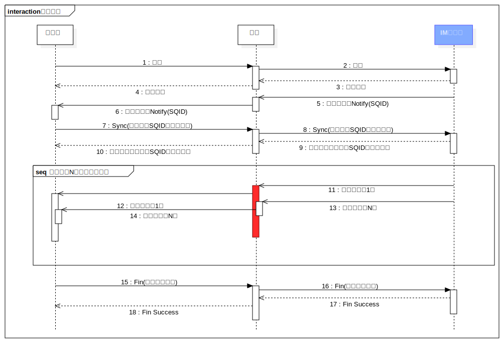

#消息协议

##基础

gs***Chat***所有的消息协议都基于[gs***RPC***](http://gsrpc.github.io/)开发， 其充分利用了gs***RPC***的以下几个特性：
> 1. 同步请求/应答模式
> 2. 异步通知模式
> 3. 双向rpc请求

> 消息在服务器与客户端之间传递，本质上它们共同组成了一个实现最终一致性行的分布式系统；
> 对于当前成熟的最终一致性系统来说，无不采用了基于序号发生器(版本)的同步方式，并且也是被理论证明的类似paxos等一致性协议的基础；
> 所以gs***Chat***在发送和接收的过程中都采用SQID来保证传输可靠性，以及丢包检查和重传；

##消息接收

1. 首先客户端登陆到IM服务器；
2. IM服务器为每个客户端创建一个用户代理；
3. 定时向客户端**异步**推送Notify消息，并且携带用户当前接收队列SQID的最大值
4. 客户端在收到Notify消息时，将接收到的SQID与本地保存的SQID比较：
   * 如果本地SQID小于接收SQID将发起一个新的Sync操作，执行步骤（5）；
   * 如果本地SQID等于接收SQID将不做任何操作；
   * 如果本地SQID大于接收SQID，表示服务发生了SQID丢失或者客户端BUG，执行步骤（？）；
5. 客户端发起**同步**Sync调用，携带接收消息起始SQID以及接收条数(num),接收范围(SQID,SQID+num]；
6. IM服务器接收到Sync调用，首先判断是否已经存在一个Sync事务：
   * 如果已经存在返回，错误ResourceBusy；
   * 如果不存在继续执行下面流程；
7. 计算服务器接受的，起始SQID以及推送条数并返回客户端；
8. 客户端与服务器并行执行以下操作：
   * IM服务器发起一个新的Sync事务，将消息异步推送给客户端；
   * 客户端接受消息并记录，排序接收消息；当客户端接收完消息或者超时；执行步骤（9）；
9. 客户端发起Fin操作关闭上一个Sync事务；并且将接收到的消息写入本地数据库，完成一次消息接收流程；

> 如上所述步骤（8），如果客户端接收失败:
> 1. 需要将已接收消息排序，
> 2. 并且通过Fetch接口重试接收遗漏消息;
